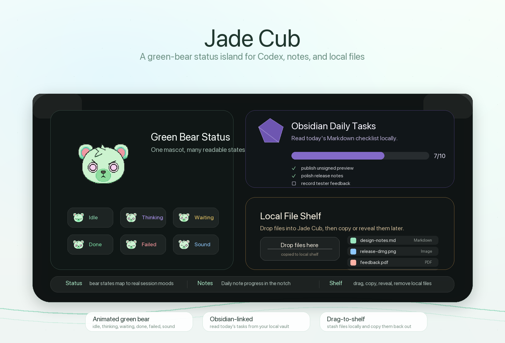

<h1 align="center">
  &nbsp;
  Jade Cub
</h1>
<p align="center">
  <b>Green-bear status island for Codex sessions, Obsidian tasks, and local file shelf</b><br>
  <a href="https://liuyuplus.github.io/jade-cub/">Website</a> •
  <a href="#installation">Install</a> •
  <a href="#features">Features</a> •
  <a href="#buddy-detach">Buddy Detach</a> •
  <a href="PRIVACY.md">Privacy</a> •
  <a href="#supported-tools">Supported Tools</a> •
  <a href="#build-from-source">Build</a><br>
  English | <a href="README.zh-CN.md">简体中文</a>
</p>

<p align="center">
  <a href="https://github.com/liuyuplus/jade-cub/releases/tag/unsigned-1.0.0">
    
  </a>
  <a href="https://github.com/liuyuplus/jade-cub/releases/download/unsigned-1.0.0/JadeCub-1.0.0-release-unsigned.dmg">
    
  </a>
  
  
  
  
</p>

<p align="center">
  
</p>


<p align="center">
  <sub>Watch the green bear change state, keep today's Obsidian tasks visible, and drop files into a local shelf for later use.</sub>
</p>

<p align="center">
  <sub>Official website: <a href="https://liuyuplus.github.io/jade-cub/">liuyuplus.github.io/jade-cub</a></sub>
</p>

<p align="center">
  &nbsp;
  &nbsp;
  &nbsp;
  &nbsp;
  &nbsp;
  
</p>
<p align="center">
  <sub>Idle · Thinking · Waiting · Done · Failed · Sound</sub>
</p>

<a id="green-bear-notes-shelf"></a>
## Green Bear, Notes, and Shelf

Jade Cub is built around a small local workflow instead of a generic dashboard: the green bear shows session mood at a glance, Obsidian keeps today's tasks in the notch, and the Shelf lets you drop files into a local holding area while you work.

- **Green bear states** - Idle, thinking, waiting, done, failed, and sound states make the app feel like one companion instead of a pile of badges.
- **Obsidian daily-task progress** - Read today's Markdown checklist from your local vault and show completed / total progress without uploading notes.
- **Drag-to-Shelf files** - Drop files into Jade Cub's local Shelf, select several, copy them back to the pasteboard, reveal them in Finder, or remove them when done.

<a id="buddy-detach"></a>
## Floating Buddy

Jade Cub can detach the active Buddy from the notch. Press and hold the notch, drag the Buddy upward out of the notch area, and it becomes an independent floating companion that stays with you across other windows.

- **Three-step interaction** - press and hold, drag outward, then let go to keep the Buddy floating.
- **Independent floating presence** - keep session awareness visible even when you are no longer watching the top notch.
- **Free placement with low disruption** - move the Buddy where it helps without pinning it to the menu bar.
- **Same Island context** - the floating Buddy still represents the same live session, mascot identity, and progress cues.

## What is Jade Cub?

Jade Cub is a Codex-first macOS status island for people who want their AI coding workflow to feel visible, local, and a little more alive. It stays quiet in the menu bar until something needs attention, then opens into a notch-style surface for green-bear state, Obsidian task progress, file staging, questions, approvals, summaries, and focus return.

It still listens to Codex app-server sessions, Codex CLI hooks, Claude-style hooks, Gemini CLI hooks, Hermes Agent plugin hooks, Qwen Code hooks, OpenClaw hooks plus transcripts, OpenCode plugins, and compatible IDE integrations. Those integrations support the workflow, but the product center is Jade Cub's bear, notes, and shelf.

## Features

Jade Cub is shaped around the small local affordances that make daily agent work easier to follow.

- **Green-bear status language** - A single mint bear carries idle, thinking, waiting, done, failed, and sound states across the closed island, open panel, and floating Buddy.
- **Obsidian daily tasks** - Configure your vault, Daily directory, filename pattern, and optional template path; Jade Cub reads today's Markdown checklist locally and shows progress in the island.
- **Local file Shelf** - Drag files into the island, copy selected files back to the pasteboard, reveal stored copies in Finder, and clear the shelf without involving a server.
- **Ask and approve in place** - Answer follow-up questions, approve or deny tool requests, and review completion summaries without hunting through terminal tabs.
- **One-click focus return** - Jump back to the right iTerm2, Ghostty, Terminal.app, tmux pane, Cursor, VS Code-compatible editor, or client window.
- **Floating Buddy** - Drag the active Buddy out of the notch so the green bear can stay nearby as an independent companion.
- **Local sounds** - Use macOS sounds, built-in 8-bit cues, or imported local sound packs for session events.
- **Local-first privacy posture** - Jade Cub has no analytics or hosted backend by default; hooks, window metadata, optional notes, and transcripts stay on your Mac unless you connect external tools yourself.
- **Advanced bridges kept out of the way** - Remote SSH and integration-management code remains available in the project, but the default settings UI stays focused on the everyday local workflow.

<a id="supported-tools"></a>
## Supported Tools

Jade Cub also ships VS Code-compatible focus extensions for VS Code, Cursor, CodeBuddy, WorkBuddy, and Qoder. `QoderWork` is hook-only today and does not participate in the IDE extension path.

Hermes Agent is integrated through a generated plugin directory at `~/.hermes/plugins/ping_island/`. Hermes' gateway hook directories under `~/.hermes/hooks/` do not run in the CLI, so Jade Cub uses the official `ctx.register_hook()` plugin surface to observe prompt submission, tool activity, model replies, and session end events.

Qwen Code is supported as a first-class hook client through `~/.qwen/settings.json`, with its own calm mint-scarf mascot in the app's client identity system.

OpenClaw is supported through a managed internal hook directory under `~/.openclaw/hooks/` plus transcript-aware session refresh from `~/.openclaw/agents/main/sessions/`. That combination lets Jade Cub surface OpenClaw's lightweight message hooks quickly, then backfill the full conversation from the local session log once the assistant reply lands.

The underlying SSH bridge can still bootstrap onto a remote macOS or Linux host, rewrite compatible hook configs, and forward events back into the local menu-bar UI. The default settings panel intentionally keeps this advanced workflow out of sight for now.

The green bear state images come from the app asset catalog. Additional client mascot previews can be regenerated from the live `MascotView` implementation with `./scripts/render-mascots.sh`.

<a id="installation"></a>
## Installation

### Download a Release

1. Download the current [unsigned preview DMG](https://github.com/liuyuplus/jade-cub/releases/download/unsigned-1.0.0/JadeCub-1.0.0-release-unsigned.dmg), or visit [Releases](https://github.com/liuyuplus/jade-cub/releases/tag/unsigned-1.0.0) for the ZIP as well.
2. Open the DMG.
3. Move `Jade Cub.app` into your Applications folder.
4. Launch the app and start the clients you want Jade Cub to monitor.

> The current public build is unsigned and not notarized. On first launch, macOS may require Control-click -> Open or `System Settings -> Privacy & Security -> Open Anyway`. Jade Cub may also ask for Accessibility / Apple Events permissions for focus-return features.

<a id="build-from-source"></a>
### Build from Source

Requires macOS 14+ and an Xcode toolchain that can build the Xcode project and the Swift 6.1 `Prototype` package tests.

```bash
git clone https://github.com/liuyuplus/jade-cub.git
cd jade-cub

# Debug build
xcodebuild -project PingIsland.xcodeproj -scheme PingIsland -configuration Debug build

# Release build
xcodebuild -project PingIsland.xcodeproj -scheme PingIsland -configuration Release build
```

To create a locally shareable unsigned package for local testing:

```bash
./scripts/package-unsigned.sh
```

The script re-signs the built app bundle with a consistent ad-hoc signature before creating the `.dmg` and `.zip`, which helps embedded frameworks launch more reliably on another machine. The package is still unsigned for distribution and not notarized, so first launch may still require `Open` from Finder's context menu or manual quarantine removal.
The generated files land in `releases/unsigned/` as `JadeCub-<version>.dmg` and `JadeCub-<version>.zip`.
The DMG uses the repo-tracked installer artwork at `docs/images/jade-cub-dmg-installer-background.png` by default; set `JADE_CUB_DMG_BACKGROUND_SOURCE` if you want to preview a different background locally.

To create signed and notarized release packages in GitHub Actions, configure the release secrets described in [docs/sparkle-release.md](docs/sparkle-release.md) and run `.github/workflows/release-packages.yml` against a `v*` tag or the manual workflow dispatch input.

The same workflow also publishes a Linux `Jade Cub Bridge` asset that Jade Cub can download when bootstrapping Linux SSH hosts.

For the full notarized release flow and the GitHub Releases backed Sparkle appcast setup, see [docs/sparkle-release.md](docs/sparkle-release.md).

## Testing

The fastest full-repo regression path is:

```bash
./scripts/test.sh
```

That covers:

```bash
swift test --package-path Prototype
xcodebuild -project PingIsland.xcodeproj -scheme PingIsland -configuration Debug CODE_SIGNING_ALLOWED=NO test -only-testing:PingIslandTests
xcodebuild -project PingIsland.xcodeproj -scheme PingIsland -configuration Debug CODE_SIGN_IDENTITY=- test
```

Useful targeted slices:

```bash
swift test --package-path Prototype --filter IslandBridgeE2ETests
xcodebuild -project PingIsland.xcodeproj -scheme PingIsland -configuration Debug CODE_SIGNING_ALLOWED=NO test -only-testing:PingIslandTests
xcodebuild -project PingIsland.xcodeproj -scheme PingIsland -configuration Debug CODE_SIGN_IDENTITY=- test -only-testing:PingIslandUITests
```

If `PingIslandUITests-Runner` stays suspended on macOS, run the UI tests from Xcode with a valid local signing identity and check `amfid` / `AppleSystemPolicy` logs before treating it as an app regression.

## Settings

Jade Cub currently ships a focused settings panel:

- **General** - launch at login and baseline app behavior
- **Display** - notch display target and placement behavior
- **Obsidian** - optional daily-task note path, template path, and filename pattern
- **Shortcuts** - keyboard access for the Island and active sessions
- **Mascot** - client mascot previews, per-client overrides, animation states
- **Sound** - event-specific sounds, sound pack mode, sound pack import
- **About** - version, updates, GitHub links, and diagnostics export

Remote SSH and integration-management settings are intentionally hidden from the default panel for now so the app stays Codex-first and easier to ship. The underlying bridge code remains in the project for future demand.

The Obsidian page is optional and disabled until configured. It stores only the paths you choose in local app settings; the repository uses placeholder examples instead of personal vault paths.

## Custom Sounds

Jade Cub currently supports three sound modes under `Settings -> Sound`:

- **System sounds** - choose a macOS sound for each event.
- **Built-in 8-bit** - use Island's bundled retro sound set, including the fixed client startup sound.
- **Sound pack** - load a local OpenPeon / CESP-compatible pack from disk.

### Quick setup

1. Open `Settings -> Sound`.
2. Turn on `Enable sounds`.
3. Pick the mode you want:
   - `System sounds` if you just want a different macOS sound per event.
   - `Sound pack` if you want fully custom audio files.
4. Preview each event with the play button and leave only the event toggles you want enabled.

### Import a local sound pack

1. Switch `Sound mode` to `Sound pack`.
2. Click `Import local sound pack`.
3. Choose a folder that contains `openpeon.json`.
4. Pick the imported pack from the `Sound pack` dropdown.

Jade Cub also auto-discovers packs placed under `~/.openpeon/packs` and `~/.claude/hooks/peon-ping/packs`.

### Minimal sound pack layout

```text
my-pack/
  openpeon.json
  session-start.wav
  attention.ogg
  complete.mp3
  error.wav
  limit.wav
```

```json
{
  "cesp_version": "1.0",
  "name": "my-pack",
  "display_name": "My Pack",
  "categories": {
    "task.acknowledge": {
      "sounds": [{ "file": "session-start.wav", "label": "Session Start" }]
    },
    "input.required": {
      "sounds": [{ "file": "attention.ogg", "label": "Attention" }]
    },
    "task.complete": {
      "sounds": [{ "file": "complete.mp3", "label": "Complete" }]
    },
    "task.error": {
      "sounds": [{ "file": "error.wav", "label": "Error" }]
    },
    "resource.limit": {
      "sounds": [{ "file": "limit.wav", "label": "Limit" }]
    }
  }
}
```

### Event mapping

- `Processing started` checks `task.acknowledge`, then `session.start`.
- `Attention required` checks `input.required`.
- `Task completed` checks `task.complete`.
- `Task error` checks `task.error`.
- `Resource limit` checks `resource.limit`.

Release builds can also publish a Linux `Jade Cub Bridge` artifact alongside the macOS app packages, which Jade Cub uses when bootstrapping remote SSH hosts that are not running macOS.

Sound packs can use `.wav`, `.mp3`, or `.ogg` files. If a selected pack does not provide a matching category for an event, Jade Cub falls back to the macOS system sound selected for that event.

## How It Works

```text
Claude / Codex / Gemini CLI / OpenCode / Cursor / Qoder / CodeBuddy / WorkBuddy / Copilot / ...
  -> hook or app-server event
    -> Jade Cub monitor + normalization layer
      -> SessionStore
        -> SessionMonitor / NotchViewModel
          -> notch, list, hover preview, completion popup
```

Implementation details worth knowing:

- Claude-family tools enter through managed hook files plus the embedded `Jade Cub Bridge` launcher.
- Codex sessions can come from hook events or the live `codex app-server` websocket monitor.
- Gemini CLI hooks are installed into `~/.gemini/settings.json`; tool matchers use Gemini's regex-based hook matcher syntax.
- Qwen Code hooks are installed into `~/.qwen/settings.json`; the bridge follows the official event names and uses `Stop` / `SessionEnd` / `Notification` messages to surface popup-ready summaries in Island.
- OpenCode is wired through a generated plugin file under `~/.config/opencode/plugins/`.
- Advanced remote bridge code can bootstrap `Jade Cub Bridge`, rewrite compatible hooks, and forward remote events back into the local Jade Cub UI when that workflow is enabled.
- Focus routing spans iTerm2, Ghostty, Terminal.app, tmux, and VS Code-compatible IDE extensions.

## Requirements

- macOS 14.0 or later
- Best experience on MacBooks with a notch, but external displays are supported too
- Install whichever CLI or desktop clients you want Jade Cub to monitor

## Privacy

Jade Cub is local-first and does not include analytics or telemetry by default. See [PRIVACY.md](PRIVACY.md) for the current data-handling notes, including optional Obsidian paths, local transcript reading, update checks, and hidden remote SSH bridge behavior.

## Acknowledgments

Jade Cub is based on [Ping Island](https://github.com/erha19/ping-island) by erha19 and keeps its Apache 2.0 license lineage. Ping Island itself builds on the broader idea space of notch-first agent monitors such as [claude-island](https://github.com/farouqaldori/claude-island). Thank you to the upstream authors for making that work available.

## License

Apache 2.0 - see [LICENSE.md](LICENSE.md).
