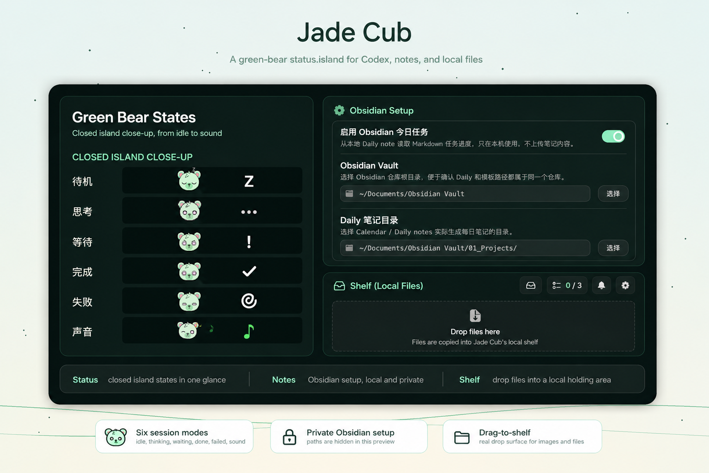

<h1 align="center">
  &nbsp;
  Jade Cub
</h1>
<p align="center">
  <b>绿色熊头状态岛：连接 Codex、Obsidian 今日任务和本地文件暂存</b><br>
  <a href="https://liuyuplus.github.io/jade-cub/">官网</a> •
  <a href="#安装">安装</a> •
  <a href="#功能特性">功能</a> •
  <a href="#buddy-离岛">Buddy 离岛</a> •
  <a href="PRIVACY.md">隐私</a> •
  <a href="#从源码构建">构建</a><br>
  <a href="README.md">English</a> | 简体中文
</p>

<p align="center">
  <a href="https://github.com/liuyuplus/jade-cub/releases/tag/unsigned-1.0.0">
    
  </a>
  <a href="https://github.com/liuyuplus/jade-cub/releases/download/unsigned-1.0.0/JadeCub-1.0.0-release-unsigned.dmg">
    
  </a>
  
  
  
  
</p>

<p align="center">
  
</p>

<p align="center">
  <sub>看绿色熊头状态变化、同步 Obsidian 今日任务进度，并把文件拖进本地 Shelf 暂存。</sub>
</p>

<p align="center">
  &nbsp;
  &nbsp;
  &nbsp;
  &nbsp;
  &nbsp;
  
</p>
<p align="center">
  <sub>待机 · 思考 · 等待 · 完成 · 失败 · 声音</sub>
</p>

## 绿色熊头、Obsidian 和 Shelf

Jade Cub 不是一个泛泛的 Agent 看板。它的核心是一个更贴近日常工作的小流程：绿色熊头表达当前状态，Obsidian 显示今日任务进度，Shelf 用来把临时文件拖进本地暂存区。

- **绿色熊头状态** - 待机、思考、等待、完成、失败、声音等状态统一使用 Jade Cub 自己的绿色熊头视觉。
- **Obsidian 今日任务** - 从你本地 vault 的 Daily note 读取 Markdown 任务进度，只显示完成数和总数，不上传笔记内容。
- **拖放文件暂存** - 把文件拖进 Jade Cub 的本地 Shelf，可多选复制回剪贴板、在访达中显示或移除。

<a id="buddy-离岛"></a>
## Buddy 离岛

Jade Cub 支持把当前 Buddy 从刘海里拖出来：长按刘海，向上拖出刘海区域，松手后它会变成独立悬浮的小伙伴。离岛后的 Buddy 仍然代表同一个实时会话、客户端形象和进度状态。

## Jade Cub 是什么？

Jade Cub 是一个 Codex-first 的 macOS 状态岛。它平时安静待在菜单栏/刘海区域；当 Codex 或其他编码 Agent 需要你注意时，它会用绿色熊头状态、Obsidian 任务进度、文件 Shelf、追问、审批、完成摘要和窗口跳转把现场收拢到顶部。

它仍然支持 Codex App、Codex CLI hooks、Claude Code、Gemini CLI、Qwen Code、OpenCode、Cursor、Qoder、CodeBuddy、GitHub Copilot 等来源，但这些集成只是支撑能力；产品中心是 Jade Cub 自己的绿色熊头、笔记和文件暂存工作流。

<a id="功能特性"></a>
## 功能特性

- **绿色熊头状态语言** - 待机、思考、等待、完成、失败、声音等状态贯穿 closed island、展开面板和离岛 Buddy。
- **Codex-first 状态岛** - 平时保持紧凑，思考、审批、追问、完成等状态会在刘海区域即时呈现。
- **原地处理** - 可以直接在 Island 里处理审批、回答追问，并查看完成提示。
- **一键跳回现场** - 快速回到对应的 iTerm2、Ghostty、Terminal.app、tmux pane 或兼容 IDE 窗口。
- **Obsidian 今日任务** - 可选读取你配置的 Daily note 路径，显示今日任务进度；只保存本地路径，不包含个人 vault 内容。
- **本地文件 Shelf** - 支持把文件拖进 Island 暂存，之后可多选复制、在访达中显示、打开或移除。
- **自定义声音** - 支持 macOS 系统音、内置 8-bit 音效，以及本地 OpenPeon / CESP 主题包。
- **绿色 Buddy 离岛** - 把当前 Buddy 从刘海拖出来，保持在桌面上作为独立悬浮陪伴。
- **多客户端兼容** - 支持 Codex、Claude Code、Gemini CLI、Qwen Code、OpenCode、Cursor、Qoder、CodeBuddy、GitHub Copilot 等 hook 或 app-server 来源。
- **远程与集成能力保留** - 远程 SSH 和集成管理代码仍在项目中，但默认设置页先隐藏，避免普通用户被暂时用不到的配置打扰。

<a id="支持的工具"></a>
## 支持的工具

Jade Cub 当前关注 Codex 和 Claude Code，同时保留多 Agent 兼容层：

- Codex App + Codex CLI：Codex app-server、hooks、rollout 解析兜底。
- Claude Code：Claude 兼容 hooks、审批、追问、完成提醒。
- Gemini CLI / Qwen Code / OpenCode：通过各自 hook 或插件机制接入。
- Cursor / Qoder / CodeBuddy / WorkBuddy：通过 hook 与 VS Code 兼容聚焦扩展辅助跳转。
- GitHub Copilot CLI / Agent hooks：通过兼容事件进入同一套 Island UI。

## 安装

1. 下载当前 [未签名预览版 DMG](https://github.com/liuyuplus/jade-cub/releases/download/unsigned-1.0.0/JadeCub-1.0.0-release-unsigned.dmg)，或打开 [Releases](https://github.com/liuyuplus/jade-cub/releases/tag/unsigned-1.0.0) 获取 ZIP。
2. 打开 DMG。
3. 将 `Jade Cub.app` 拖到 Applications。
4. 启动应用，并打开你希望 Jade Cub 监控的客户端。

当前预览包为 ad-hoc 签名且未做 Apple notarization。首次启动时，macOS 可能需要你在 Finder 中 Control-click / 右键选择 Open，或到 `System Settings -> Privacy & Security -> Open Anyway`。窗口聚焦功能还可能需要辅助功能 / Apple Events 权限。

<a id="从源码构建"></a>
## 从源码构建

需要 macOS 14+，以及能构建 Xcode 工程和 Swift 6.1 `Prototype` 包的 Xcode 工具链。

```bash
git clone https://github.com/liuyuplus/jade-cub.git
cd jade-cub

xcodebuild -project PingIsland.xcodeproj -scheme PingIsland -configuration Debug build
xcodebuild -project PingIsland.xcodeproj -scheme PingIsland -configuration Release build
```

如果你想生成本地测试用的未签名安装包：

```bash
./scripts/package-unsigned.sh
```

产物会输出到 `releases/unsigned/`，文件名类似 `JadeCub-<version>-release-unsigned.dmg` 和 `JadeCub-<version>-release-unsigned.zip`。未签名包只适合本地测试，首次打开可能需要在 Finder 里右键选择 Open。

如果要做 Developer ID 签名、notarization 和 Sparkle appcast，请参考 [docs/sparkle-release.md](docs/sparkle-release.md)。

## 设置面板

Jade Cub 当前保留一个更聚焦的设置面板：

- **通用** - 登录启动、基础行为。
- **显示** - 选择 Island 所在显示器和全屏行为。
- **Obsidian** - 可选开启今日任务，配置 vault、Daily 目录、模板路径和文件名模式。
- **快捷键** - Island 和会话跳转的键盘访问。
- **宠物** - Jade Cub 头像、客户端覆盖和状态预览。
- **声音** - 事件声音、声音包模式、声音包导入。
- **关于** - 版本、更新、GitHub 链接和诊断导出。

远程 SSH 和集成管理暂时从默认设置页隐藏。如果后续用户需求明确，可以再把它们以更清晰的高级设置形式放回来。

## Obsidian 今日任务

Obsidian 页面是可选功能，默认不需要配置。你可以按自己的 vault 结构填写：

- `Obsidian Vault`：vault 根目录。
- `Daily 笔记目录`：每日笔记所在目录。
- `文件名模式`：例如 `yyyy-MM-dd`。
- `模板路径`：可选，用于说明或后续扩展，不会提交你的真实路径到仓库。

Jade Cub 只在本机读取你选择的 Markdown 文件，用来显示今日任务进度；不会把笔记内容上传到任何 Jade Cub 服务。

## 自定义音效

在 `设置 -> 声音` 里可以选择三种模式：

- **系统音** - 为每个事件选择 macOS 系统音。
- **内置 8-bit** - 使用内置复古音效。
- **主题包** - 从本地导入兼容 OpenPeon / CESP 的音效包。

主题包的最小结构如下：

```text
my-pack/
  openpeon.json
  session-start.wav
  attention.ogg
  complete.mp3
  error.wav
  limit.wav
```

## 工作原理

```text
Codex / Claude Code / Gemini CLI / OpenCode / Cursor / Qoder / CodeBuddy / Copilot / ...
  -> hook 或 app-server 事件
    -> Jade Cub 监控与归一化层
      -> SessionStore
        -> SessionMonitor / NotchViewModel
          -> 刘海、列表、hover 预览、完成提示
```

## 系统要求

- macOS 14.0 或更高。
- 带刘海的 MacBook 体验最好，也支持外接显示器。
- 安装你希望 Jade Cub 监控的 CLI 或桌面客户端。

## 隐私

Jade Cub 是 local-first 应用，默认不包含产品分析、遥测或托管后端。它会根据你启用的功能读取本地 hook 事件、会话元数据、窗口信息和可选 Obsidian 路径。详细说明见 [PRIVACY.md](PRIVACY.md)。

## 致谢

Jade Cub 基于 [Ping Island](https://github.com/erha19/ping-island) by erha19 改造，并延续 Apache 2.0 许可证。Ping Island 也属于 [claude-island](https://github.com/farouqaldori/claude-island) 等刘海式 Agent 监视器的思路谱系。感谢上游作者把这些工作开源出来。

## 许可证

Apache 2.0，详见 [LICENSE.md](LICENSE.md)。
